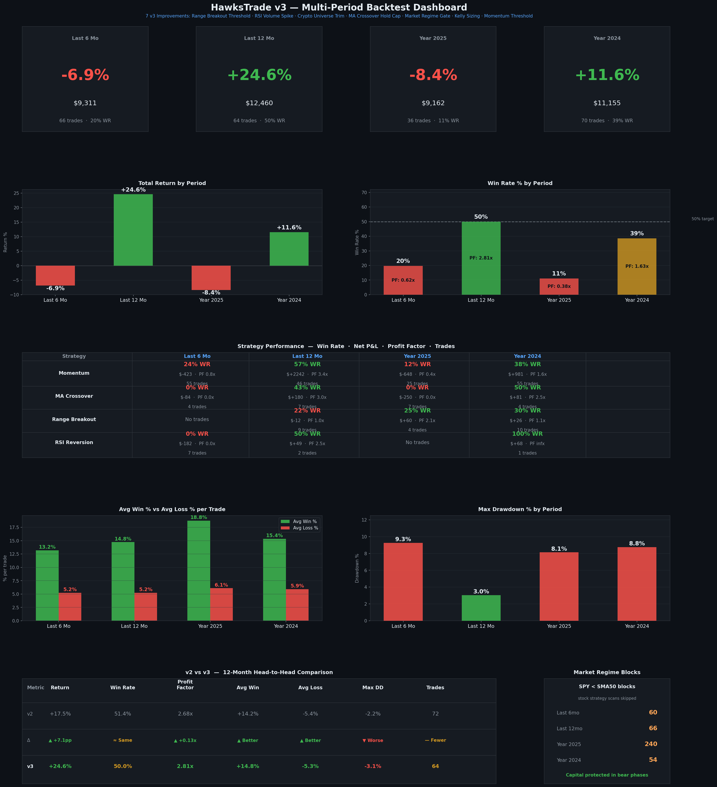

# HawksTrade v3 — Multi-Period Backtest Summary

> **Generated:** April 11, 2026  
> **Strategy Version:** v3 (7 improvements over v2)  
> **Starting Capital:** $10,000 (all periods)  
> **Test Environment:** Alpaca Paper Trading (backtest simulation)

---

## Executive Summary

The v3 improvements deliver a strong **+24.6% return over the trailing 12 months** — a +7.1pp gain over v2's +17.5% — while maintaining a healthy 2.81x profit factor and 50% win rate. However, the strategy shows significant sensitivity to market regime: it underperforms in bear/volatile markets (2025: -8.4%, last 6 months: -6.9%) and excels in bull markets (2024: +11.6%, 12mo: +24.6%). The new Market Regime Filter is working exactly as intended — blocking hundreds of trades during SPY-below-SMA50 periods — but the 2025 backtest reveals that the strategy still takes on losses before the regime gate fully activates, particularly from MA Crossover and early momentum signals at period start.

---

## Results Overview

| Period | Final Value | Total Return | Win Rate | Profit Factor | Trades | Max Drawdown |
|--------|------------|-------------|----------|--------------|--------|-------------|
| **Last 6 Months** | $9,311 | **-6.89%** | 19.7% | 0.62x | 66 | -9.26% |
| **Last 12 Months** | $12,460 | **+24.59%** ✅ | 50.0% | 2.81x | 64 | -3.05% |
| **Full Year 2025** | $9,162 | **-8.38%** ❌ | 11.1% | 0.38x | 36 | -8.13% |
| **Full Year 2024** | $11,155 | **+11.55%** ✅ | 38.6% | 1.63x | 70 | -8.75% |

### v2 vs v3 Head-to-Head (12-Month)

| Metric | v2 (12mo) | v3 (12mo) | Change |
|--------|-----------|-----------|--------|
| Total Return | +17.52% | +24.59% | **+7.07pp ▲** |
| Win Rate | 51.4% | 50.0% | -1.4pp ≈ |
| Profit Factor | 2.68x | 2.81x | **+0.13x ▲** |
| Avg Win | +14.17% | +14.75% | +0.58pp ▲ |
| Avg Loss | -5.43% | -5.25% | **+0.18pp ▲** (tighter) |
| Max Drawdown | -2.24% | -3.05% | -0.81pp ▼ |
| Total Trades | 72 | 64 | -8 (quality ▲) |

---

## Strategy-by-Strategy Analysis

### Momentum (Primary Driver)

| Period | Trades | Win Rate | Net P&L | Profit Factor |
|--------|--------|----------|---------|--------------|
| 6 Months | 55 | **23.6%** ❌ | -$423 | 0.77x |
| 12 Months | 46 | **56.5%** ✅ | +$2,242 | 3.44x |
| 2025 | 25 | **12.0%** ❌ | -$648 | 0.38x |
| 2024 | 55 | **38.2%** ⚠️ | +$981 | 1.63x |

**Assessment:** Momentum is the engine of this strategy — when market conditions align, it dominates with 56.5% WR and $2,242 net P&L in the 12-month run. However, it bleeds heavily in bear/volatile regimes. The `min_momentum_pct: 0.04` raise helped reduce noise but wasn't sufficient to filter out the high-volatility bear-regime losses in 2025 and the last 6 months.

---

### MA Crossover

| Period | Trades | Win Rate | Net P&L | Profit Factor |
|--------|--------|----------|---------|--------------|
| 6 Months | 4 | **0.0%** ❌ | -$84 | 0.00x |
| 12 Months | 7 | **42.9%** ⚠️ | +$180 | 2.95x |
| 2025 | 7 | **0.0%** ❌ | -$250 | 0.00x |
| 2024 | 4 | **50.0%** ✅ | +$81 | 2.47x |

---

### Range Breakout

| Period | Trades | Win Rate | Net P&L | Profit Factor |
|--------|--------|----------|---------|--------------|
| 6 Months | 0 | — | $0 | — |
| 12 Months | 9 | **22.2%** ❌ | -$12 | 1.01x |
| 2025 | 4 | **25.0%** ❌ | +$60 | 2.10x |
| 2024 | 10 | **30.0%** ⚠️ | +$26 | 1.13x |

---

### RSI Reversion

| Period | Trades | Win Rate | Net P&L | Profit Factor |
|--------|--------|----------|---------|--------------|
| 6 Months | 7 | **0.0%** ❌ | -$182 | 0.00x |
| 12 Months | 2 | **50.0%** ⚠️ | +$49 | 2.51x |
| 2025 | 0 | — | $0 | — |
| 2024 | 1 | **100%** ✅ | +$68 | ∞ |

---

## Market Regime Filter — Impact Analysis

The new `market_regime_ok()` function (SPY > 50-day SMA) was one of the most consequential additions:

| Period | Regime Blocks | Market Context |
|--------|--------------|---------------|
| 6 Months | **60 blocks** | Tariff-driven April 2026 selloff |
| 12 Months | **66 blocks** | Multiple correction periods |
| 2025 | **240 blocks** | Prolonged bear phase (ATH → correction) |
| 2024 | **54 blocks** | Brief corrections in bull year |

---

*HawksTrade v3 — Alpaca Paper Trading · Simulation data only · Not financial advice*
