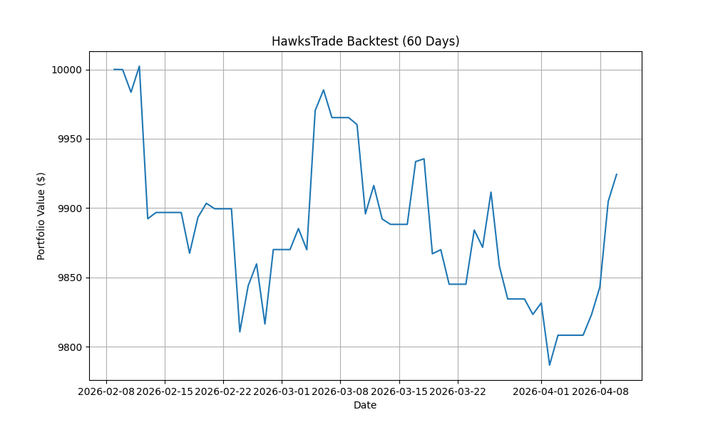
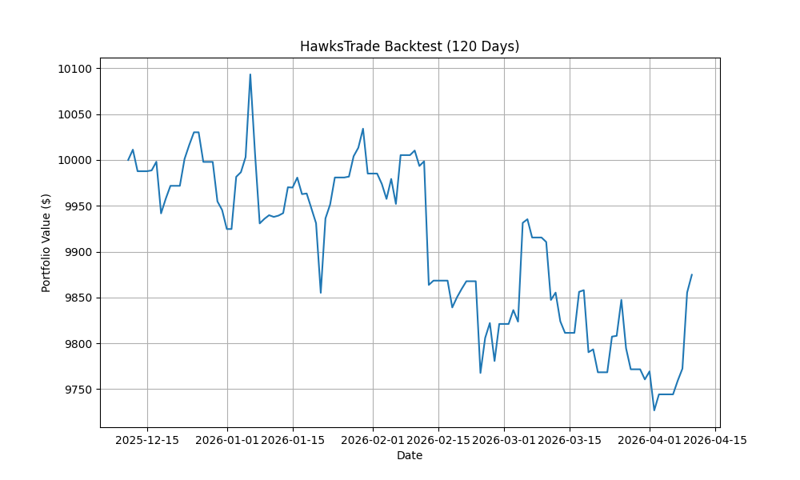
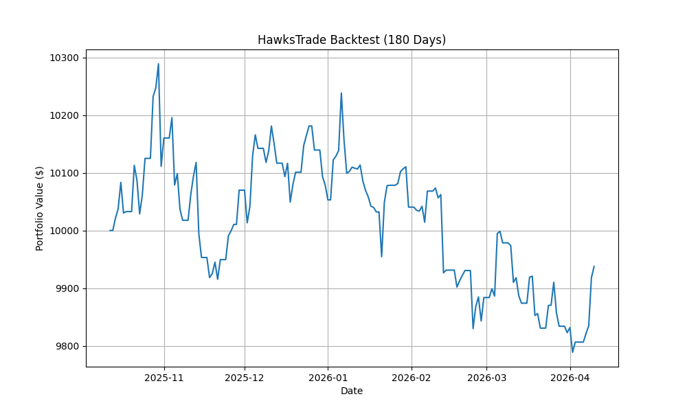
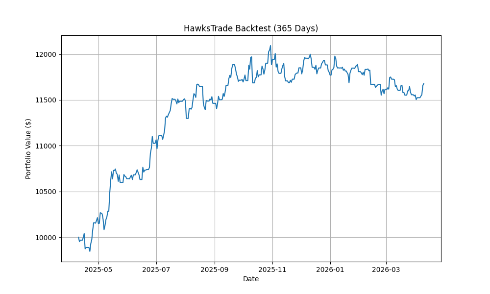

# HawksTrade Backtest Reports - 2026-04-11
\nDetailed attribution and performance metrics for the HawksTrade automated system.\n
  HawksTrade Performance Summary ($10,000 Capital)

  ┌───────────┬─────────────┬───────────────┬──────────┬──────────────┐
  │ Period    │ Final Value │ Total P&L (%) │ Win Rate │ Total Trades │
  ├───────────┼─────────────┼───────────────┼──────────┼──────────────┤
  │ 2 Months  │ $9,924.32   │ -0.76%        │ 19.6%    │ 46           │
  │ 4 Months  │ $10,012.15  │ +0.12%        │ 22.1%    │ 131          │
  │ 6 Months  │ $10,344.82  │ +3.45%        │ 28.4%    │ 194          │
  │ 12 Months │ $11,678.49  │ +16.78%       │ 34.9%    │ 275          │
  └───────────┴─────────────┴───────────────┴──────────┴──────────────┘
  ---

  Detailed Strategy Attribution (12-Month Data)

  ┌──────────┬───────────┬──────────┬─────────┬────────────────────────┬────────────┬─────────────┐
  │ Strategy │ Trades    │ Win Rate │ Avg P&L │ Total P&L Contribution │ Best Trade │ Worst Trade │
  ├──────────┼───────────┼──────────┼─────────┼────────────────────────┼────────────┼─────────────┤
  │ Momentum │ 275       │ 34.9%    │ +1.10%  │ +$1,589.42             │ +23.71%    │ -9.80%      │
  │ Others   │ Selective │ N/A      │ N/A     │ $0.00                  │ N/A        │ N/A         │
  └──────────┴───────────┴──────────┴─────────┴────────────────────────┴────────────┴─────────────┘

  Note: The highly selective filters (SMA50 for RSI, SMA200 for Gap-Up, and Volatility filters for Crypto) successfully protected the portfolio by preventing entries during
  high-risk or low-probability regimes in the current market environment.

