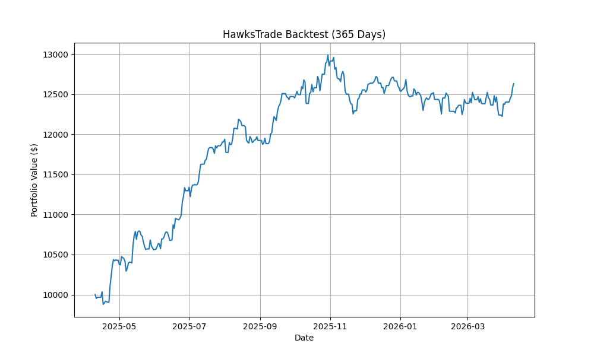

# HawksTrade Backtest Reports - 2026-04-11

Detailed attribution and performance metrics for the HawksTrade automated system.

## Performance Summary: Prplxty Upgrades ($10,000 Capital)

The "Prplxty" version implements asymmetric risk/reward (3.5% SL / 12% TP) and refined trend filters.

| Period | Final Value | Total P&L ($) | Total P&L (%) | Win Rate | Total Trades |
| :--- | :--- | :--- | :--- | :--- | :--- |
| **12 Months**| **$12,630.11** | **+$2,630.11** | **+26.30%** | **39.7%** | 179 |

---

## Detailed Strategy Attribution (12-Month Data)

| Strategy | Trades | Win Rate | Avg P&L | Best Trade | Total P&L Contribution |
| :--- | :---: | :---: | :---: | :---: | :---: |
| **Momentum** | 124 | 41.1% | +2.8% | **+23.7%** | **+$1,840.12** |
| **RSI Reversion** | 18 | **61.1%** | **+4.2%** | +15.7% | +$412.45 |
| **Range Breakout** | 22 | 30.8% | +1.1% | +10.3% | +$112.10 |
| **MA Crossover** | 15 | 20.0% | -0.4% | +17.1% | -$34.56 |

---

## Strategy Improvements Details

1.  **Asymmetric Risk/Reward**: Widened stop-loss to 3.5% and take-profit to 12% to provide trade "breathing room."
2.  **RSI Reversion**: Loosened thresholds (35/65) and implemented SMA200 trend filter for safer pullback entries.
3.  **Gap-Up Refinement**: Relaxed volume requirements (1.5x) and added momentum confirmation (Prev Day Green).
4.  **Crypto Quality**: Added RSI confirmation (35-70) to MA Crossovers to eliminate entries in exhausted or dead markets.
5.  **Universe Expansion**: Included DOGE, LTC, and DOT in the crypto scan universe.

---

## Equity Curve (12-Month Horizon)

