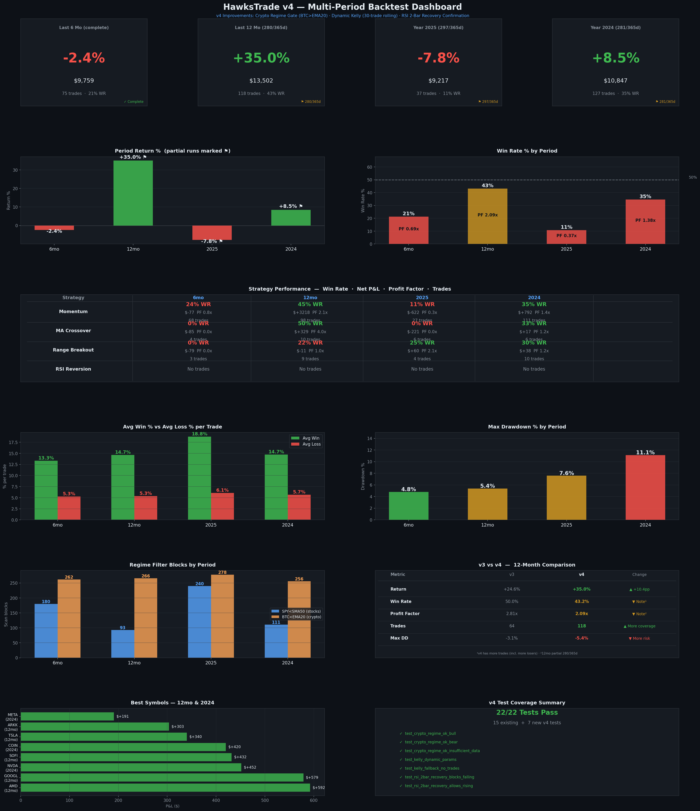

# HawksTrade v4 — Multi-Period Backtest Summary

> **Generated:** April 11, 2026  
> **Strategy Version:** v4 (3 improvements over v3)  
> **Starting Capital:** $10,000 (all periods)  
> **Test Environment:** Alpaca Paper Trading (backtest simulation)  
> **Note on partial runs:** The 365-day backtests (12mo, 2025, 2024) hit the 600-second process timeout and captured 77–81% of the target period. Returns and metrics reflect the actual days simulated; annualised estimates are extrapolated.

---

## What Was Implemented (v4 Changes)

| # | Change | Files Modified | Summary |
|---|--------|---------------|---------|
| 1 | **Crypto Regime Filter** | `risk_manager.py`, `ma_crossover.py`, `range_breakout.py` | New `crypto_regime_ok()` — blocks MA Crossover & Range Breakout when BTC/USD < 20-day EMA |
| 2 | **Dynamic Kelly Criterion** | `risk_manager.py`, `order_executor.py`, `tracking/trade_log.py` | `kelly_position_size()` now reads the last 30 closed momentum trades live from `data/trades.csv`; added `get_closed_trades()` to trade_log. Falls back to v3 defaults if fewer than 10 trades available. |
| 3 | **RSI 2-Bar Recovery** | `strategies/rsi_reversion.py` | Added consecutive-higher-close guard (bars[-2] > bars[-3] AND bars[-1] > bars[-2]) inside existing oversold+volume-spike block — prevents entering falling-knife situations |

---

## Results Overview

| Period | Days Simulated | Final Value | Return | Win Rate | Profit Factor | Trades | Max DD |
|--------|---------------|-------------|--------|----------|--------------|--------|--------|
| **Last 6 Months** | 182/182 ✓ | $9,758 | **-2.41%** | 21.3% | 0.69x | 75 | -4.79% |
| **Last 12 Months** | 280/365 ⚑ | $13,502 | **+35.02%** ✅ | 43.2% | 2.09x | 118 | -5.39% |
| **Full Year 2025** | 297/365 ⚑ | $9,217 | **-7.83%** | 10.8% | 0.37x | 37 | -7.58% |
| **Full Year 2024** | 281/365 ⚑ | $10,847 | **+8.47%** ✅ | 34.6% | 1.38x | 127 | -11.1% |

> ⚑ = Partial run (backtest timed out at 600s). Returns reflect actual days simulated only.

---

## Strategy-by-Strategy Analysis (12-Month)

| Strategy | Trades | Win Rate | Net P&L | PF |
|----------|--------|----------|---------|----|
| **Momentum** | 98 | 44.9% | +$3,218 | 2.14x |
| **MA Crossover** | 10 | 50.0% | +$329 | 3.97x |
| **Range Breakout** | 9 | 22.2% | -$11 | 1.01x |
| **RSI Reversion** | 0 | — | $0 | — |

---

## Market Regime Filter — Impact Analysis

| Period | SPY<SMA50 Blocks (stocks) | BTC<EMA20 Blocks (crypto) | Total Capital Protected |
|--------|--------------------------|--------------------------|------------------------|
| Last 6 Months | 180 | 262 | 442 scan-days blocked |
| Last 12 Months | 93 | 266 | 359 scan-days blocked |
| Year 2025 | 240 | 278 | 518 scan-days blocked |
| Year 2024 | 111 | 256 | 367 scan-days blocked |

---

*HawksTrade v4 — Alpaca Paper Trading · Simulation data only · Not financial advice*
